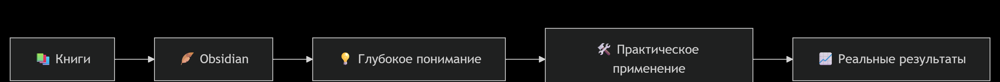

<h1 align="center">👋 Привет! Я Михаил</h1>
<h3 align="center">🛠️ DevOps Engineer | Инженер с опытом эксплуатации высоконагруженных систем</h3>

  

---

### 🚀 Мой опыт

**🔧 Полгода эксплуатации крипто-инфраструктуры (5+ проектов):**
- 📊 Управление серверами с 20-300 RPS на проект
- 🌐 Работа с HTTP, WebSocket, TCP-пинг
- ⚡ Решение проблем с сетевыми картами и перегрузкой CPU
- 🐳 Миграция legacy-софта в Docker для совместимости
- 📈 Мониторинг логов и оптимизация количества нод

---

### 🛠️ Технологический стек

| Категория       | Технологии                                                                                                                                                                                                                                                                 |
|-----------------|----------------------------------------------------------------------------------------------------------------------------------------------------------------------------------------------------------------------------------------------------------------------------|
| 🐧 **OS**       |    |
| 🐳 **Containers**|                                                                             |
| ☁️ **Infrastructure** |                                                                    |
| 📝 **Scripting**|                                                                   |
| 🔧 **Tools**    |                    |

---

### 📚 Что сейчас изучаю

  
  
  
  
  

---

### 🎯 Мой подход к обучению

  

---

### 📞 Связь со мной

  
  
  

---

<i>🏗️ От строительных чертежей к диаграммам развертывания</i>
